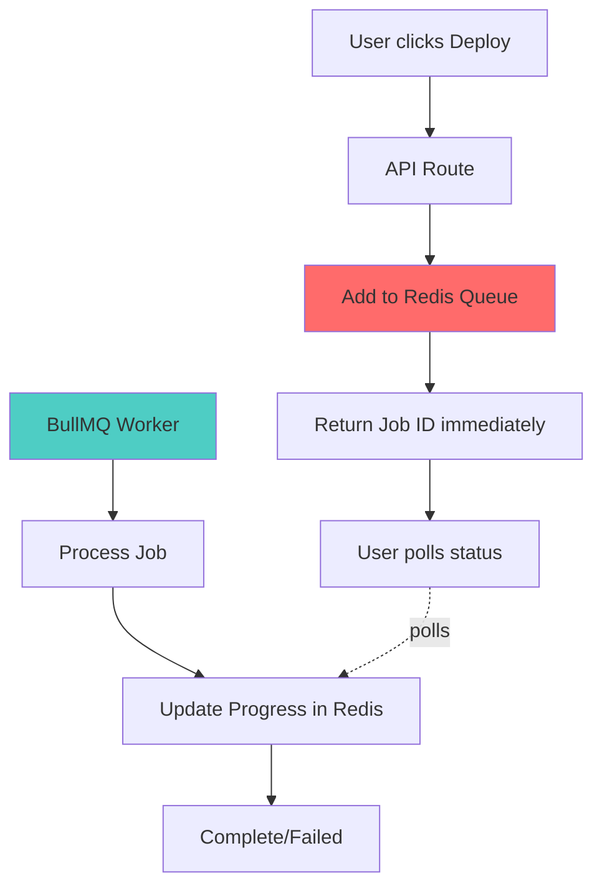

# 🚀 Job Queue Implementation Plan

## Redis + BullMQ cho Theme Editor Platform

> **Goal:** Chuyển các task nặng (deploy, AI generation) từ blocking HTTP requests sang background jobs để cải thiện UX và tránh timeouts.

---

## 📋 OVERVIEW

### Current Problems

| Issue                     | Impact                        | Example                      |
| ------------------------- | ----------------------------- | ---------------------------- |
| Deploy blocks 2-5 minutes | HTTP timeout, poor UX         | User wait, can't do anything |
| No retry mechanism        | Deploy fails = manual restart | Lost work                    |
| In-memory queue           | Lost on restart               | Pending deploys vanish       |
| Can't track progress      | User confused                 | "Is it still processing?"    |

### Target Architecture



---

## 🎯 PHASE 1: Infrastructure Setup (Day 1-2)

### 1.1 Install Redis

#### On VPS (Production)

```bash
# SSH to VPS
ssh deploy@your-vps-ip

# Install Redis
sudo apt update
sudo apt install redis-server -y

# Configure Redis
sudo nano /etc/redis/redis.conf
# Change: supervised systemd
# Add: maxmemory 512mb
# Add: maxmemory-policy allkeys-lru

# Start Redis
sudo systemctl start redis-server
sudo systemctl enable redis-server

# Verify
redis-cli ping  # Should return PONG
```

#### On Local Dev

```powershell
# Windows - Use WSL2
wsl --install
wsl

# Inside WSL
sudo apt update
sudo apt install redis-server -y
sudo service redis-server start
redis-cli ping
```

**Or use Docker:**

```yaml
# docker-compose.yml (add this service)
services:
  redis:
    image: redis:7-alpine
    ports:
      - "6379:6379"
    volumes:
      - redis-data:/data
    command: redis-server --maxmemory 512mb --maxmemory-policy allkeys-lru

volumes:
  redis-data:
```

### 1.2 Install Dependencies

```bash
cd /var/www/theme-editor
npm install bullmq ioredis @types/ioredis
```

**Updated package.json:**

```json
{
  "dependencies": {
    "bullmq": "^5.0.0",
    "ioredis": "^5.3.2"
  },
  "devDependencies": {
    "@types/ioredis": "^5.0.0"
  }
}
```

---

## 🏗️ PHASE 2: Queue Infrastructure (Day 2-3)

### 2.1 Create Queue Configuration

**File:** `src/lib/queue/config.ts`

```typescript
import { ConnectionOptions } from "bullmq";

export const redisConnection: ConnectionOptions = {
  host: process.env.REDIS_HOST || "localhost",
  port: parseInt(process.env.REDIS_PORT || "6379"),
  password: process.env.REDIS_PASSWORD,
  maxRetriesPerRequest: null, // Required for BullMQ
  enableReadyCheck: false,
};

export const queueConfig = {
  defaultJobOptions: {
    attempts: 3,
    backoff: {
      type: "exponential" as const,
      delay: 5000, // 5s, 25s, 125s
    },
    removeOnComplete: {
      count: 100, // Keep last 100 completed jobs
      age: 24 * 3600, // 24 hours
    },
    removeOnFail: {
      count: 500, // Keep last 500 failed jobs for debugging
    },
  },
};
```

### 2.2 Create Queue Instances

**File:** `src/lib/queue/queues.ts`

```typescript
import { Queue } from "bullmq";
import { redisConnection, queueConfig } from "./config";

// Deploy Queue
export const deployQueue = new Queue("deploy", {
  connection: redisConnection,
  defaultJobOptions: {
    ...queueConfig.defaultJobOptions,
    timeout: 10 * 60 * 1000, // 10 minutes max
  },
});

// AI Generation Queue
export const aiQueue = new Queue("ai-generation", {
  connection: redisConnection,
  defaultJobOptions: {
    ...queueConfig.defaultJobOptions,
    timeout: 2 * 60 * 1000, // 2 minutes max
  },
});

// Export Queue (if needed later)
export const exportQueue = new Queue("export", {
  connection: redisConnection,
  defaultJobOptions: {
    ...queueConfig.defaultJobOptions,
    timeout: 5 * 60 * 1000, // 5 minutes max
  },
});
```

### 2.3 Define Job Types

**File:** `src/lib/queue/types.ts`

```typescript
// Deploy Job
export interface DeployJobData {
  projectId: string;
  userId: string;
  projectName: string;
  domain?: string;
  themeParams: any;
  createUserFolder?: boolean;
  generateDeployScript?: boolean;
  serverType?: string;
  includeAssets?: boolean;
}

export interface DeployJobResult {
  success: boolean;
  projectId: string;
  projectName: string;
  folderPath: string;
  fileCount: number;
  deployTime: number;
  error?: string;
}

// AI Generation Job
export interface AIJobData {
  userId: string;
  prompt: string;
  type: "theme" | "product-page";
  model?: string;
}

export interface AIJobResult {
  success: boolean;
  content: any;
  error?: string;
}

// Job Progress
export interface JobProgress {
  percentage: number;
  message: string;
  stage?: string;
}
```

---

## ⚙️ PHASE 3: Workers (Day 3-4)

### 3.1 Deploy Worker

**File:** `src/lib/queue/workers/deploy.worker.ts`

```typescript
import { Worker, Job } from "bullmq";
import { redisConnection } from "../config";
import { DeployJobData, DeployJobResult, JobProgress } from "../types";
import { DeployProcessor } from "@/app/api/deploy-project/deploy-processor";

export const deployWorker = new Worker<DeployJobData, DeployJobResult>(
  "deploy",
  async (job: Job<DeployJobData>) => {
    console.log(`🚀 [WORKER] Starting deploy job ${job.id}`);

    try {
      // Update progress: Starting
      await job.updateProgress({
        percentage: 0,
        message: "Initializing deployment...",
        stage: "init",
      } as JobProgress);

      // Create processor
      const processor = new DeployProcessor({
        deployData: job.data,
        userId: job.data.userId,
        projectId: job.data.projectId,
        startTime: Date.now(),
      });

      // Hook into processor progress (if available)
      // For now, manually update stages
      await job.updateProgress({
        percentage: 20,
        message: "Generating file manifest...",
        stage: "manifest",
      } as JobProgress);

      // Process deployment
      const result = await processor.process();

      await job.updateProgress({
        percentage: 100,
        message: "Deployment completed!",
        stage: "done",
      } as JobProgress);

      console.log(`✅ [WORKER] Deploy job ${job.id} completed`);
      return result;
    } catch (error) {
      console.error(`❌ [WORKER] Deploy job ${job.id} failed:`, error);
      throw error; // BullMQ will handle retries
    }
  },
  {
    connection: redisConnection,
    concurrency: 3, // Process 3 deploys simultaneously
    limiter: {
      max: 10,
      duration: 60000, // Max 10 jobs per minute
    },
  },
);

// Event listeners
deployWorker.on("completed", (job) => {
  console.log(`✅ Deploy job ${job.id} completed`);
});

deployWorker.on("failed", (job, err) => {
  console.error(`❌ Deploy job ${job?.id} failed:`, err.message);
});

deployWorker.on("progress", (job, progress) => {
  console.log(`📊 Deploy job ${job.id}: ${(progress as JobProgress).message}`);
});
```

### 3.2 AI Worker

**File:** `src/lib/queue/workers/ai.worker.ts`

```typescript
import { Worker, Job } from "bullmq";
import { redisConnection } from "../config";
import { AIJobData, AIJobResult } from "../types";
import { generateThemeContent } from "@/lib/generate-theme-core";

export const aiWorker = new Worker<AIJobData, AIJobResult>(
  "ai-generation",
  async (job: Job<AIJobData>) => {
    console.log(`🤖 [WORKER] Starting AI job ${job.id}`);

    try {
      await job.updateProgress({
        percentage: 10,
        message: "Sending request to AI...",
      });

      // Your existing AI generation logic
      const content = await generateThemeContent(
        job.data.prompt,
        job.data.type,
      );

      await job.updateProgress({
        percentage: 100,
        message: "AI generation completed!",
      });

      return {
        success: true,
        content,
      };
    } catch (error) {
      console.error(`❌ [WORKER] AI job ${job.id} failed:`, error);
      throw error;
    }
  },
  {
    connection: redisConnection,
    concurrency: 5, // 5 AI requests simultaneously
    limiter: {
      max: 20,
      duration: 60000, // Max 20 requests per minute (API limits)
    },
  },
);
```

### 3.3 Worker Manager

**File:** `src/lib/queue/workers/index.ts`

```typescript
import { deployWorker } from "./deploy.worker";
import { aiWorker } from "./ai.worker";

// Start all workers
export function startWorkers() {
  console.log("🚀 Starting BullMQ workers...");

  // Workers auto-start when imported
  // Just log confirmation
  console.log("✅ Deploy worker started");
  console.log("✅ AI worker started");
}

// Graceful shutdown
export async function stopWorkers() {
  console.log("🛑 Stopping workers...");

  await Promise.all([deployWorker.close(), aiWorker.close()]);

  console.log("✅ All workers stopped");
}

// Handle shutdown signals
process.on("SIGTERM", stopWorkers);
process.on("SIGINT", stopWorkers);
```

---

## 🔌 PHASE 4: API Integration (Day 4-5)

### 4.1 Update Deploy API

**File:** `src/app/api/deploy-project/route.ts`

```typescript
import { deployQueue } from "@/lib/queue/queues";
import { DeployJobData } from "@/lib/queue/types";

export async function POST(request: NextRequest) {
  try {
    const session = await getServerSession(authOptions);
    if (!session?.user?.id) {
      return NextResponse.json({ error: "Unauthorized" }, { status: 401 });
    }

    const deployData: DeployJobData = await request.json();

    // Validate data...
    // (existing validation code)

    // Add job to queue instead of processing directly
    const job = await deployQueue.add(
      "deploy-project",
      {
        ...deployData,
        userId: session.user.id,
      },
      {
        jobId: `deploy-${deployData.projectId}-${Date.now()}`, // Custom job ID
        priority: deployData.domain ? 1 : 5, // Custom domain = higher priority
      },
    );

    console.log(
      `✅ [API] Deploy job ${job.id} queued for ${deployData.projectName}`,
    );

    // Return immediately with job ID
    return NextResponse.json({
      success: true,
      jobId: job.id,
      message: "Deployment queued successfully",
      estimatedTime: "2-5 minutes",
    });
  } catch (error) {
    console.error("[API] Failed to queue deploy:", error);
    return NextResponse.json(
      { success: false, error: "Failed to queue deployment" },
      { status: 500 },
    );
  }
}
```

### 4.2 Job Status Endpoint

**File:** `src/app/api/jobs/[jobId]/route.ts`

```typescript
import { NextRequest, NextResponse } from "next/server";
import { deployQueue, aiQueue } from "@/lib/queue/queues";
import { getServerSession } from "next-auth";
import { authOptions } from "@/lib/auth";

export async function GET(
  request: NextRequest,
  { params }: { params: { jobId: string } },
) {
  try {
    const session = await getServerSession(authOptions);
    if (!session?.user?.id) {
      return NextResponse.json({ error: "Unauthorized" }, { status: 401 });
    }

    const { jobId } = params;

    // Try to find job in deploy queue
    let job = await deployQueue.getJob(jobId);
    let queueName = "deploy";

    // If not found, try AI queue
    if (!job) {
      job = await aiQueue.getJob(jobId);
      queueName = "ai-generation";
    }

    if (!job) {
      return NextResponse.json(
        { success: false, error: "Job not found" },
        { status: 404 },
      );
    }

    // Get job state
    const state = await job.getState();
    const progress = job.progress;
    const result = job.returnvalue;
    const failedReason = job.failedReason;

    return NextResponse.json({
      success: true,
      job: {
        id: job.id,
        name: job.name,
        queue: queueName,
        state, // waiting, active, completed, failed, delayed
        progress,
        result,
        error: failedReason,
        attemptsMade: job.attemptsMade,
        timestamp: job.timestamp,
        processedOn: job.processedOn,
        finishedOn: job.finishedOn,
      },
    });
  } catch (error) {
    console.error("[API] Failed to get job status:", error);
    return NextResponse.json(
      { success: false, error: "Failed to fetch job status" },
      { status: 500 },
    );
  }
}
```

### 4.3 List User Jobs

**File:** `src/app/api/jobs/route.ts`

```typescript
export async function GET(request: NextRequest) {
  try {
    const session = await getServerSession(authOptions);
    if (!session?.user?.id) {
      return NextResponse.json({ error: "Unauthorized" }, { status: 401 });
    }

    // Get recent jobs for this user
    const [completedDeploys, failedDeploys, activeDeploys] = await Promise.all([
      deployQueue.getCompleted(0, 9), // Last 10 completed
      deployQueue.getFailed(0, 9), // Last 10 failed
      deployQueue.getActive(0, 9), // Current active
    ]);

    const jobs = [...completedDeploys, ...failedDeploys, ...activeDeploys]
      .filter((job) => job.data.userId === session.user.id)
      .map((job) => ({
        id: job.id,
        name: job.name,
        state: job.getState(),
        data: job.data,
        progress: job.progress,
        timestamp: job.timestamp,
      }));

    return NextResponse.json({ success: true, jobs });
  } catch (error) {
    return NextResponse.json(
      { error: "Failed to fetch jobs" },
      { status: 500 },
    );
  }
}
```

---

## 🎨 PHASE 5: Frontend Integration (Day 5-6)

### 5.1 Job Polling Hook

**File:** `src/hooks/useJobStatus.ts`

```typescript
import { useState, useEffect, useCallback } from "react";

interface JobStatus {
  id: string;
  state: "waiting" | "active" | "completed" | "failed";
  progress: { percentage: number; message: string } | null;
  result: any;
  error: string | null;
}

export function useJobStatus(jobId: string | null, pollInterval = 2000) {
  const [status, setStatus] = useState<JobStatus | null>(null);
  const [loading, setLoading] = useState(false);

  const fetchStatus = useCallback(async () => {
    if (!jobId) return;

    try {
      const res = await fetch(`/api/jobs/${jobId}`);
      const data = await res.json();

      if (data.success) {
        setStatus(data.job);

        // Stop polling if job is done
        if (data.job.state === "completed" || data.job.state === "failed") {
          return true; // Signal to stop polling
        }
      }
    } catch (error) {
      console.error("Failed to fetch job status:", error);
    }

    return false; // Continue polling
  }, [jobId]);

  useEffect(() => {
    if (!jobId) return;

    setLoading(true);
    fetchStatus().then((shouldStop) => {
      setLoading(false);
      if (shouldStop) return;
    });

    // Poll every 2 seconds
    const interval = setInterval(async () => {
      const shouldStop = await fetchStatus();
      if (shouldStop) {
        clearInterval(interval);
      }
    }, pollInterval);

    return () => clearInterval(interval);
  }, [jobId, pollInterval, fetchStatus]);

  return { status, loading };
}
```

### 5.2 Deploy Progress Component

**File:** `src/components/DeployProgress.tsx`

```typescript
'use client'

import { useJobStatus } from '@/hooks/useJobStatus'
import { Progress } from '@/components/ui/progress'

export function DeployProgress({ jobId }: { jobId: string }) {
  const { status, loading } = useJobStatus(jobId)

  if (loading && !status) {
    return <div>Loading job status...</div>
  }

  if (!status) {
    return <div>Job not found</div>
  }

  return (
    <div className="space-y-4">
      <div className="flex justify-between">
        <span className="font-medium">
          {status.state === 'completed' ? '✅ Completed' :
           status.state === 'failed' ? '❌ Failed' :
           status.state === 'active' ? '⚙️ Processing' :
           '⏳ Waiting'}
        </span>
        <span className="text-sm text-gray-600">
          {status.progress?.percentage || 0}%
        </span>
      </div>

      <Progress value={status.progress?.percentage || 0} />

      <p className="text-sm text-gray-600">
        {status.progress?.message || 'Queued...'}
      </p>

      {status.state === 'failed' && (
        <div className="bg-red-50 border border-red-200 rounded p-3 text-sm text-red-800">
          Error: {status.error}
        </div>
      )}

      {status.state === 'completed' && status.result && (
        <div className="bg-green-50 border border-green-200 rounded p-3 text-sm">
          ✅ Deployed {status.result.fileCount} files in {status.result.deployTime}ms
        </div>
      )}
    </div>
  )
}
```

---

## 🚀 PHASE 6: Worker Process Setup (Day 6)

### 6.1 Create Worker Script

**File:** `workers.js` (root of project)

```javascript
// Worker process - separate from Next.js app
require("dotenv").config();
const { startWorkers } = require("./dist/lib/queue/workers");

console.log("🚀 Starting BullMQ worker process...");
startWorkers();

console.log("✅ Workers ready and listening for jobs");
```

### 6.2 Update PM2 Config

**File:** `ecosystem.config.js`

```javascript
module.exports = {
  apps: [
    {
      name: "theme-editor",
      script: "npm",
      args: "start",
      cwd: "/var/www/theme-editor",
      instances: "max",
      exec_mode: "cluster",
      env: {
        NODE_ENV: "production",
        PORT: 3033,
      },
    },
    {
      name: "theme-editor-workers",
      script: "./workers.js",
      cwd: "/var/www/theme-editor",
      instances: 1, // Single worker instance
      exec_mode: "fork",
      autorestart: true,
      watch: false,
      env: {
        NODE_ENV: "production",
      },
    },
  ],
};
```

### 6.3 Deploy Commands

```bash
# Build project
npm run build

# Restart PM2 apps
pm2 restart ecosystem.config.js
pm2 save

# Check status
pm2 list
pm2 logs theme-editor-workers
```

---

## 📊 PHASE 7: Monitoring & Dashboard (Day 7)

### 7.1 BullMQ Board (Optional)

```bash
npm install @bull-board/api @bull-board/nextjs
```

**File:** `src/app/admin/queues/route.ts`

```typescript
import { createBullBoard } from "@bull-board/api";
import { BullMQAdapter } from "@bull-board/api/bullMQAdapter";
import { NextAdapter } from "@bull-board/nextjs";
import { deployQueue, aiQueue } from "@/lib/queue/queues";

const serverAdapter = new NextAdapter();

createBullBoard({
  queues: [new BullMQAdapter(deployQueue), new BullMQAdapter(aiQueue)],
  serverAdapter,
});

serverAdapter.setBasePath("/admin/queues");

export const GET = serverAdapter.getRouter();
```

Access at: `https://geekgolfers.com/admin/queues`

---

## ✅ TESTING CHECKLIST

### Unit Tests

```typescript
// tests/queue/deploy.test.ts
import { deployQueue } from "@/lib/queue/queues";

describe("Deploy Queue", () => {
  it("should add job to queue", async () => {
    const job = await deployQueue.add("test-deploy", { projectId: "123" });
    expect(job.id).toBeDefined();
  });

  it("should process job successfully", async () => {
    // Mock DeployProcessor
    // Add job
    // Wait for completion
    // Assert result
  });
});
```

### Integration Tests

1. **Deploy Flow:**
   - POST to `/api/deploy-project`
   - Verify job ID returned
   - Poll `/api/jobs/{jobId}`
   - Verify state transitions: waiting → active → completed

2. **Failure Handling:**
   - Trigger deploy with invalid data
   - Verify job fails
   - Verify retry attempts
   - Verify final failed state

3. **Concurrency:**
   - Submit 10 deploys simultaneously
   - Verify all complete
   - Verify no race conditions

---

## 📝 ENVIRONMENT VARIABLES

Add to `.env`:

```env
# Redis Configuration
REDIS_HOST=localhost
REDIS_PORT=6379
REDIS_PASSWORD=  # Optional, set in production

# Queue Settings
QUEUE_CONCURRENCY_DEPLOY=3
QUEUE_CONCURRENCY_AI=5
```

---

## 🎯 SUCCESS METRICS

| Metric                 | Before          | After               | Target          |
| ---------------------- | --------------- | ------------------- | --------------- |
| Deploy UX              | User waits 5min | Returns immediately | ✅ <1s          |
| Max concurrent deploys | ~3              | 10+                 | ✅ 10+          |
| Timeout errors         | Frequent        | Rare                | ✅ <1%          |
| Lost jobs on restart   | 100%            | 0%                  | ✅ 0%           |
| Job retry capability   | None            | 3 attempts          | ✅ Auto-retry   |
| Progress visibility    | None            | Real-time           | ✅ Live updates |

---

## 🚨 ROLLBACK PLAN

If issues occur:

```bash
# Stop workers
pm2 stop theme-editor-workers

# Revert to synchronous processing
git revert <commit-hash>
npm run build
pm2 restart theme-editor
```

**Fallback:** Keep old deploy code in `/api/deploy-project/route.ts.backup`

---

## 📚 RESOURCES

- [BullMQ Documentation](https://docs.bullmq.io/)
- [Redis Documentation](https://redis.io/docs/)
- [Next.js + BullMQ Guide](https://github.com/OptimalBits/bull/blob/develop/PATTERNS.md)

---

## ⏱️ TIMELINE SUMMARY

| Phase                    | Duration     | Tasks                       |
| ------------------------ | ------------ | --------------------------- |
| Phase 1: Infrastructure  | 1-2 days     | Install Redis, dependencies |
| Phase 2: Queue Setup     | 1 day        | Create queues, config       |
| Phase 3: Workers         | 1-2 days     | Build workers               |
| Phase 4: API Integration | 1 day        | Update endpoints            |
| Phase 5: Frontend        | 1 day        | Progress UI                 |
| Phase 6: Deployment      | 0.5 day      | PM2 setup                   |
| Phase 7: Monitoring      | 0.5 day      | Dashboard                   |
| **Total**                | **6-7 days** | Full implementation         |

---

**Next Step:** Start with Phase 1 - Install Redis on VPS! 🚀
